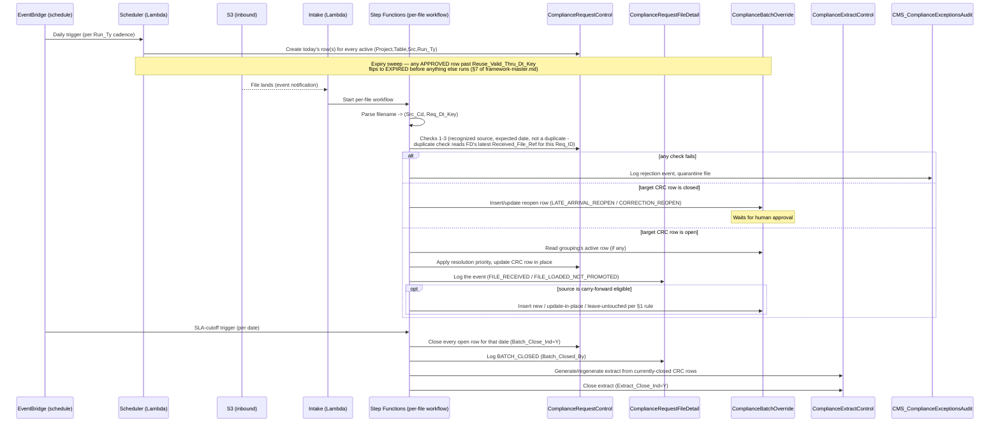
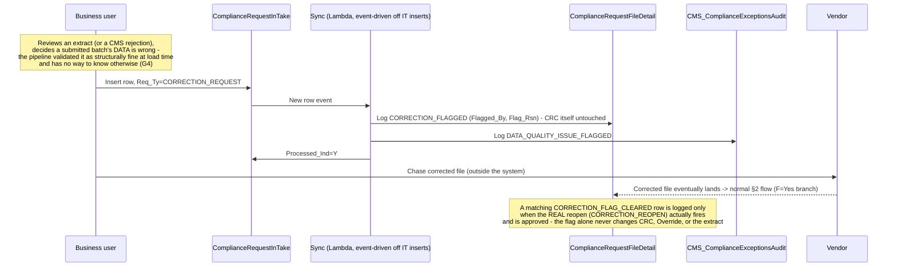
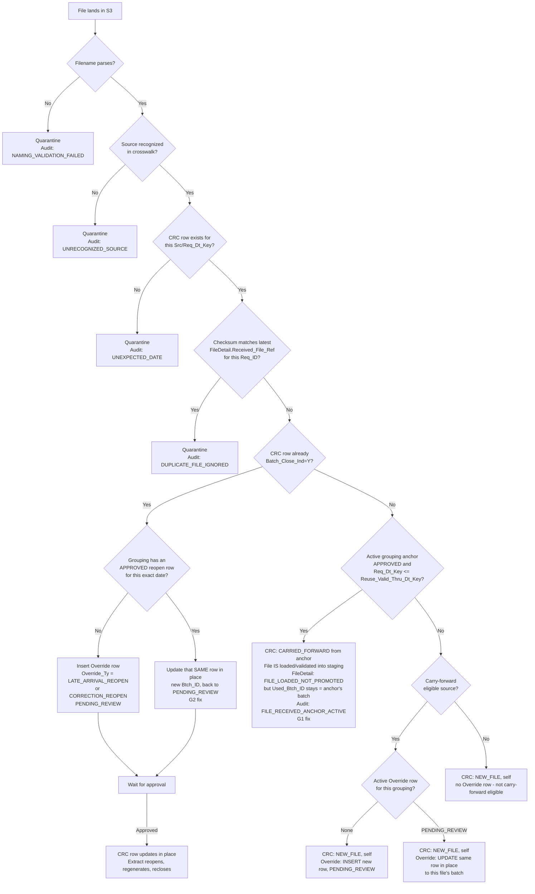
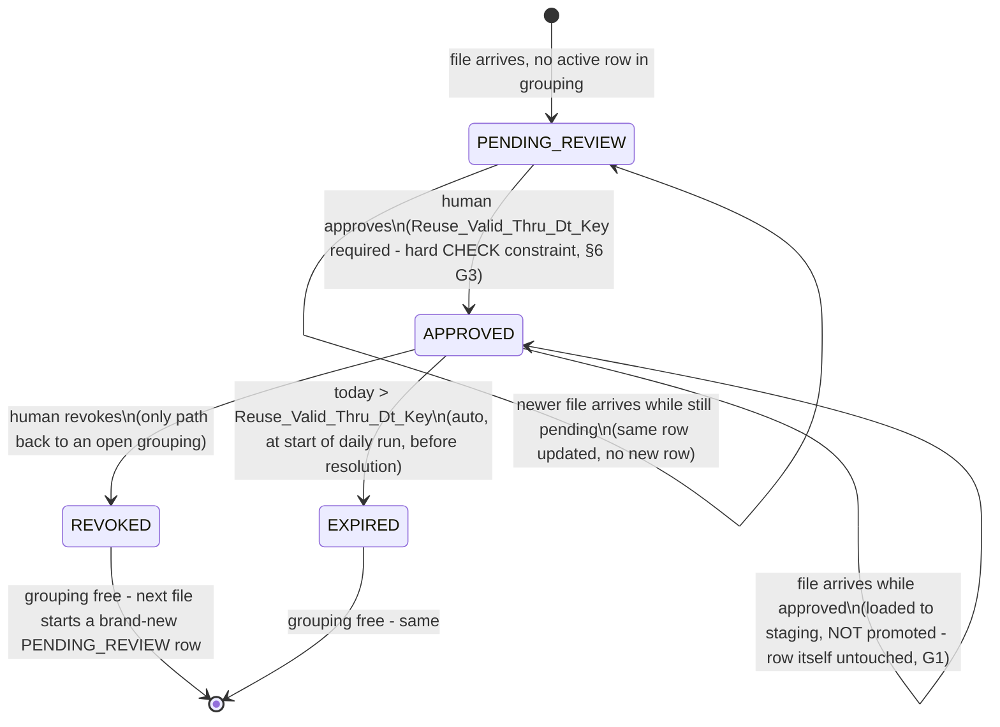

# CMS Compliance Framework — Orchestration & Flow

Companion to [`framework-master.md`](framework-master.md) (the design
reference — requirements, DDLs, failure points). This document is the
**process view**: what actually runs, in what order, on what AWS service,
for every file and every day.

## 1. Daily orchestration — who runs what, when

## 1a. The manual flag path (independent of the sequence above)

## 2. Per-file decision flow (the logic inside the Step Functions workflow)

## 3. Anchor lifecycle (the state machine behind `ComplianceBatchOverride`)

## 4. AWS service mapping

| Step | Service | Notes |
|---|---|---|
| Daily row creation, expiry sweep | Lambda, triggered by EventBridge | Runs once per `Run_Ty` cadence, before any file processing for the day |
| Manual data-quality flag sync (§1a) | Lambda, triggered by `ComplianceRequestInTake` insert event | The one part of the pipeline started by a human write, not a file or schedule |
| File-landed trigger | S3 event notification → Lambda | Starts the per-file Step Functions execution |
| Per-file decision flow (§2) | Step Functions | One execution per file; each decision node is a Lambda task or a Choice state reading `ComplianceDataSetSourceXwalk` / `ComplianceRequestControl` / `ComplianceBatchOverride` |
| Rules validation / staging load | Glue job, invoked from the Step Functions workflow | Runs regardless of whether the file will be promoted (G1) — a loaded-but-not-promoted file still passes through this |
| CRC / FileDetail / Override / ExtractControl writes | Lambda, using RDS for PostgreSQL | All tables' constraints (unique indexes, the `CHECK` on `Reuse_Valid_Thru_Dt_Key`) are enforced at the database layer, not just in application code |
| "Is this row currently late/flagged?" lookups | `vw_crc_current_flags` (a view, queried directly — no dedicated compute) | Answers what used to be plain CRC columns, computed from `ComplianceRequestFileDetail` on read instead of stored on write |
| SLA-cutoff close + extract generation | EventBridge scheduled trigger → Step Functions | Independent schedule from file arrival — fires whether or not every source reported in |
| Notifications (rejections, pending approvals, expiries) | SNS, fed by `CMS_ComplianceExceptionsAudit` inserts | Approval queue and rejection visibility both come from this one table |

## 5. What each diagram is answering

- **§1 (sequence)** — the daily rhythm: what's scheduled versus what's
  event-driven, and where the expiry sweep sits relative to file
  processing (before, always).
- **§1a (sequence)** — the one path in the whole system that starts with
  a human typing something in, not a file or a clock: flagging that
  already-submitted data is wrong, days or weeks before any fix exists
  (G4). Deliberately kept separate from Override — a flag alone changes
  nothing downstream.
- **§2 (flowchart)** — the exact branch every file takes, including the
  two fixes from `framework-master.md` §6 inline at the nodes where they
  apply (G1 at the "loaded but not promoted" node, G2 at the "update the
  same reopen row" node).
- **§3 (state machine)** — the Override row's lifecycle in isolation,
  since it's the one table whose *sequence* of states (not just current
  value) actually drives behavior elsewhere in the system.
- **§4 (service mapping)** — turns the above into an actual build list.
