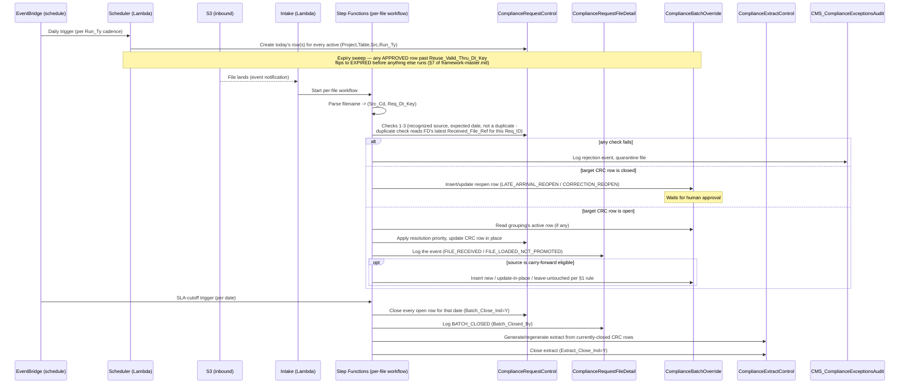
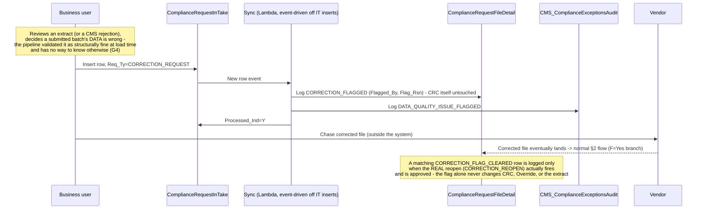
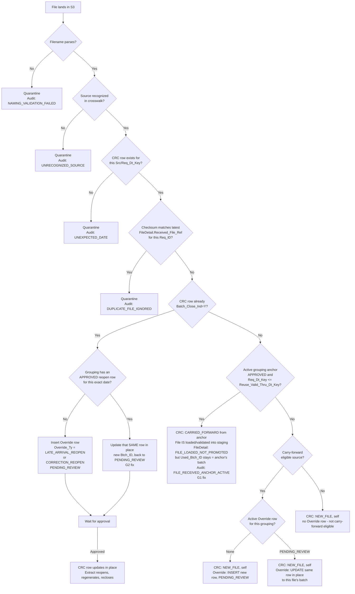
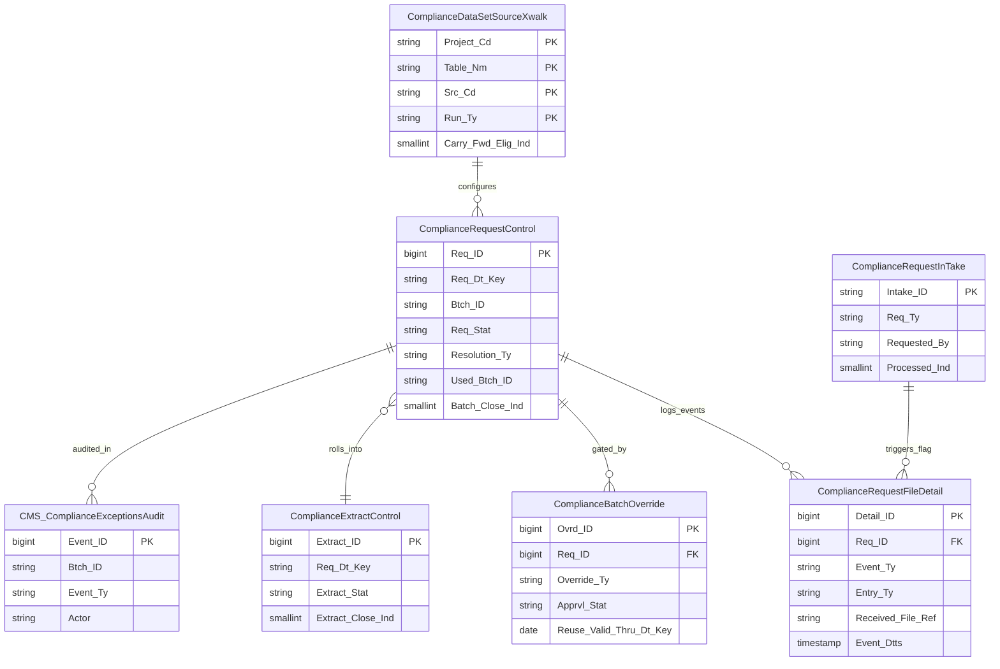
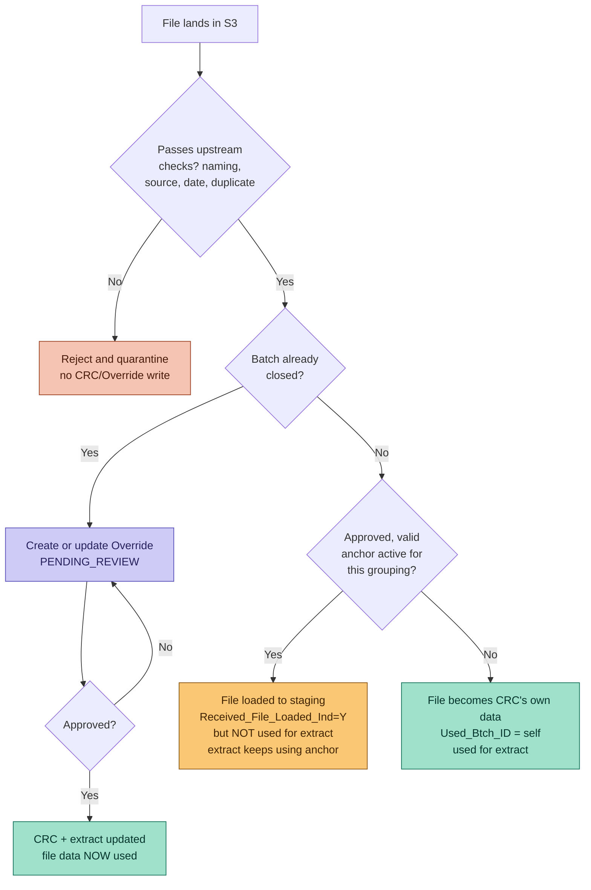
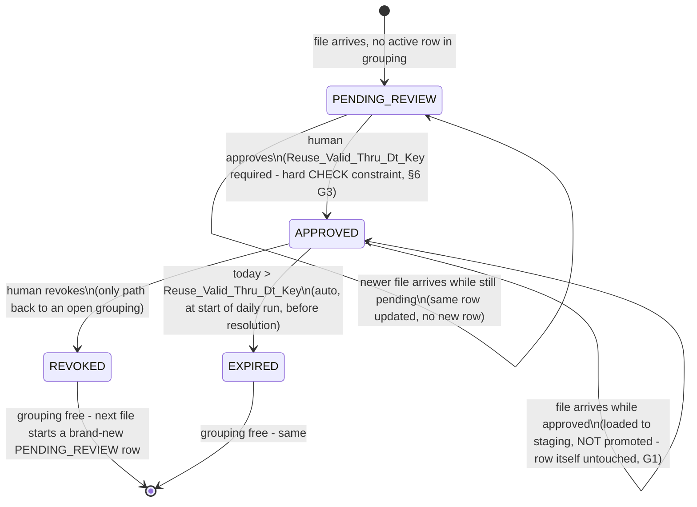

# CMS Compliance Framework — Orchestration & Flow

Companion to [`framework-master.md`](framework-master.md) (the design
reference — requirements, DDLs, failure points). This document is the
**process view**: what actually runs, in what order, on what table and
what AWS service, for every file and every day — daily and manual-flag
sequencing (§1, §1a), the per-file decision logic both as a Step
Functions flow (§2) and as a table-level ERD (§2a), that same logic
redrawn around where a file's data actually ends up (§3), a fully
worked reopen example with concrete before/after row values (§4), the
Override state machine (§5), and the AWS service mapping (§6).

## 1. Daily orchestration — who runs what, when

## 1a. The manual flag path (independent of the sequence above)

## 2. Per-file decision flow (the logic inside the Step Functions workflow)

## 2a. Table-level design (how the tables connect)

Read this alongside §2: the flowchart shows *when* each table is touched, this
shows *how they're wired*. Three relationships worth calling out:

- **CRC ← FileDetail is 1-to-many** — this is the G5 split. CRC stays at
  exactly one row per `(Project_Cd, Table_Nm, Src_Cd, Run_Ty, Req_Dt_Key)`;
  every physical thing that happens to it (received, loaded-not-promoted,
  late, closed, flagged) is a separate append-only row here instead of a
  CRC column.
- **CRC ← Override is 1-to-many, but *at most one active row* at a time**
  — the fan-out looks unlimited in the ERD, but `ux_override_one_active_per_group`
  (a partial unique index, not visible in an ERD) caps it to one
  `PENDING_REVIEW`/`APPROVED` row per grouping. Older rows only exist once
  they've moved to `REVOKED`/`EXPIRED`.
- **CRC → ExtractControl is many-to-one** — every source's CRC row for a
  date feeds the *same* extract row for that date. This is the
  relationship that makes "3 FDRs required for one extract" possible at
  all.

## 3. Combined decision flow — where does the file's data actually end up?

This is §2's logic redrawn around a single question: after everything,
**does this file's data reach the extract or not?** Every path ends in
exactly one of four outcomes, colored by what happened to the data.

The two `Yes` branches under "approved anchor active?" are the crux of
G1: a file can be perfectly valid, fully loaded, and still never feed the
extract — because *something else already governs that grouping's data*
until a human explicitly revokes it.

## 4. Worked example — reopen creation and approval, step by step

Concrete before/after values, using the actual mock-data case: FDR 1003,
`PARTCODR/ROPENS`, `Req_Dt_Key=2026-01-10`, `Run_Ty=DAILY`. The file
arrived on time and passed validation, but was later found to contain
incorrect data. Note `Btch_ID` throughout: it's built from `Req_Dt_Key`
(§5 of `framework-master.md`), so it stays **the same value across every
step** — identity, not a timestamp of when it was last touched.

**Step 0 — state before anything happens (post Jan-10 close)**

| Table | Row |
|---|---|
| CRC (`Req_ID=27`, say) | `Btch_ID=20260110_PARTCODR_ROPENS_1003_DAILY_2026_1`, `Resolution_Ty=NEW_FILE`, `Used_Btch_ID`=itself, `Batch_Close_Ind=Y` |
| Override | *(no row for this grouping — nothing to reopen yet)* |
| ExtractControl (`Req_Dt_Key=2026-01-10`) | `Extract_Stat=COMPLETE`, `Included_Src_Cds=[1001,1002,1003]`, `Extract_Close_Ind=Y` |

**Step 1 — Jan 12: business flags it (§1a, independent of the reopen itself)**

`ComplianceRequestInTake` gets a row (`Req_Ty=CORRECTION_REQUEST`,
`Requested_By=mgarcia`). Sync writes a `ComplianceRequestFileDetail` row
(`Event_Ty=CORRECTION_FLAGGED`) against `Req_ID=27`. **Nothing else
changes** — CRC, Override, and the extract are all still exactly as in
Step 0, including `Btch_ID`. This step exists purely so the gap between
"we noticed" and "it's fixed" is on record.

**Step 2 — Jan 14: corrected file arrives, gets intercepted at the "closed?" check**

Intake resolves the file to `Req_Dt_Key=2026-01-10`, looks up CRC
`Req_ID=27`, sees `Batch_Close_Ind=Y`. Per §2/§3, this routes to reopen,
not normal processing. Since `Resolution_Ty` was `NEW_FILE` (not
`MISSING`), `Override_Ty=CORRECTION_REOPEN` — a mechanical read, not a
decision.

| Table | Row written |
|---|---|
| Override (new row) | `Req_ID=27`, `Btch_ID=20260110_PARTCODR_ROPENS_1003_DAILY_2026_1` (same value as CRC's — it's the same batch identity, not a new one), `Override_Ty=CORRECTION_REOPEN`, `Prior_Btch_ID=20260110_..._1003..._1`, `Prior_Resolution_Ty=NEW_FILE`, `Apprvl_Stat=PENDING_REVIEW` |
| FileDetail | `Event_Ty=FILE_RECEIVED`, `Received_File_Ref=s3://.../1003/20260114-corrected.dat`, `Event_Dtts=2026-01-14 09:10:00` — this is where "when it actually arrived" now lives, since `Btch_ID` no longer carries it |

CRC row `Req_ID=27` is **not touched yet** — still shows the original
(incorrect) file as current.

**Step 3 — same day: `jsmith` reviews and approves**

This is the one step with no automatic path. Approval cascades three
writes in one transaction:

| Table | Before → After |
|---|---|
| Override | `Apprvl_Stat`: `PENDING_REVIEW` → `APPROVED`, `Apprvd_By=jsmith`, `Apprvd_Dtts=2026-01-14 10:15:00`, `History` appended |
| CRC (`Req_ID=27`) | `Btch_ID` **unchanged** — still `20260110_PARTCODR_ROPENS_1003_DAILY_2026_1`. What moves: `Used_Btch_ID` re-points at that same identity (now backed by the corrected file), `Batch_Close_Ind`: `Y` → `N`, then back to `Y` once the row closes again (still same `Req_ID` — never a new row) |
| FileDetail | new row, `Event_Ty=CORRECTION_FLAG_CLEARED` — closes the loop opened in Step 1 |
| ExtractControl (`Req_Dt_Key=2026-01-10`) | `Reopen_Ind`: `N`→`Y`, `Reopened_By=jsmith`. Regenerates: `Included_Src_Cds` still `[1001,1002,1003]`, now backed by the corrected 1003 data. `Extract_Close_Ind`: `Y`→`N`→`Y` again once regeneration completes |
| Audit | `CORRECTION_REOPEN_APPROVED` logged, referencing `Btch_ID=20260110_..._1` throughout — there's only ever one batch identity for this date, so the audit trail never has to reconcile two different IDs for the same thing |

**What this example demonstrates that the abstract rules don't**: the CRC
row's `Req_ID` *and* its `Btch_ID` never change across all three steps —
it's the same control-table row, identified the same way, from Jan 10
through Jan 14, just updated twice
(Step 0's initial write, Step 3's reopen). Everything that *did* need
more than one record — the flag, the file arrival, the approval, the
extract regeneration — lives in a different table each time, which is
exactly the layering §2a's ERD is describing.

## 5. Anchor lifecycle (the state machine behind `ComplianceBatchOverride`)

## 6. AWS service mapping

| Step | Service | Notes |
|---|---|---|
| Daily row creation, expiry sweep | Lambda, triggered by EventBridge | Runs once per `Run_Ty` cadence, before any file processing for the day |
| Manual data-quality flag sync (§1a) | Lambda, triggered by `ComplianceRequestInTake` insert event | The one part of the pipeline started by a human write, not a file or schedule |
| File-landed trigger | S3 event notification → Lambda | Starts the per-file Step Functions execution |
| Per-file decision flow (§2) | Step Functions | One execution per file; each decision node is a Lambda task or a Choice state reading `ComplianceDataSetSourceXwalk` / `ComplianceRequestControl` / `ComplianceBatchOverride` |
| Rules validation / staging load | Glue job, invoked from the Step Functions workflow | Runs regardless of whether the file will be promoted (G1) — a loaded-but-not-promoted file still passes through this |
| CRC / FileDetail / Override / ExtractControl writes | Lambda, using RDS for PostgreSQL | All tables' constraints (unique indexes, the `CHECK` on `Reuse_Valid_Thru_Dt_Key`) are enforced at the database layer, not just in application code |
| "Is this row currently late/flagged?" lookups | `vw_crc_current_flags` (a view, queried directly — no dedicated compute) | Answers what used to be plain CRC columns, computed from `ComplianceRequestFileDetail` on read instead of stored on write |
| SLA-cutoff close + extract generation | EventBridge scheduled trigger → Step Functions | Independent schedule from file arrival — fires whether or not every source reported in |
| Notifications (rejections, pending approvals, expiries) | SNS, fed by `CMS_ComplianceExceptionsAudit` inserts | Approval queue and rejection visibility both come from this one table |

## 7. What each diagram is answering

- **§1 (sequence)** — the daily rhythm: what's scheduled versus what's
  event-driven, and where the expiry sweep sits relative to file
  processing (before, always).
- **§1a (sequence)** — the one path in the whole system that starts with
  a human typing something in, not a file or a clock: flagging that
  already-submitted data is wrong, days or weeks before any fix exists
  (G4). Deliberately kept separate from Override — a flag alone changes
  nothing downstream.
- **§2 (flowchart)** — the exact branch every file takes, including the
  two fixes from `framework-master.md` §6 inline at the nodes where they
  apply (G1 at the "loaded but not promoted" node, G2 at the "update the
  same reopen row" node).
- **§2a (ERD)** — the schema-level companion to §2: not *when* each table
  is touched, but *how they're wired together*, including the two
  relationships an ERD alone can't fully capture (Override's one-active-
  row-per-grouping constraint, CRC's many-to-one into ExtractControl).
- **§3 (combined decision flow)** — §2 redrawn around one question only:
  does this file's data reach the extract or not. Every path terminates
  in one of four colored outcomes, so the answer is visible at a glance
  rather than requiring a trace through the full branch logic.
- **§4 (worked example)** — the abstract rules in §2/§3 made concrete:
  exact before/after row values across CRC, Override, FileDetail, and
  ExtractControl for one real reopen, end to end.
- **§5 (state machine)** — the Override row's lifecycle in isolation,
  since it's the one table whose *sequence* of states (not just current
  value) actually drives behavior elsewhere in the system.
- **§6 (service mapping)** — turns the above into an actual build list.
